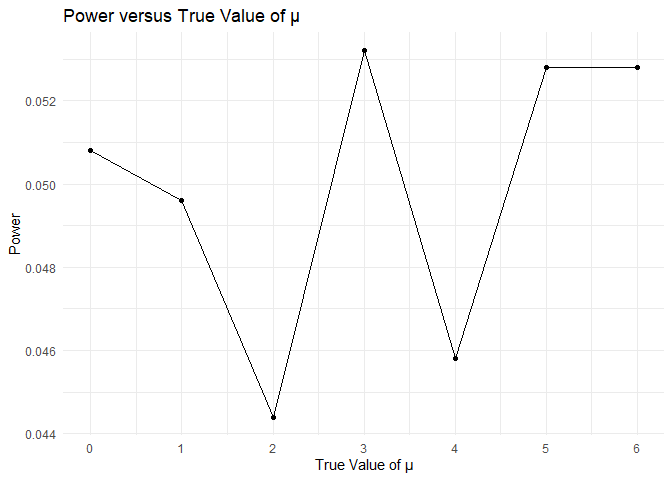

p8105_hw5_yl5508
================
Yifei LIU
2023/11/05

It’s a proj for HW5 about ITERATION.  

``` r
library(tidyverse)
options(digits = 2)
```

## Problem 1

``` r
vic_clean =
  read_csv("./data/homicide-data.csv") |>
  janitor::clean_names() |>
  mutate(city_state = str_c(city, ", ", state))
```

``` r
tot_hom =
  vic_clean |>
  group_by(city_state) |>
  summarise(
    total_homocide = n(),
    unsolved_homocide = sum(disposition  %in% c("Closed without arrest", "Open/No arrest")))
```

``` r
Bal_hom =
  vic_clean |>
  filter(city_state == "Baltimore, MD") |>
  group_by(city_state) |>
  summarise(
    total_homocide = n(),
    unsolved_homocide = sum(disposition  %in% c("Closed without arrest
", "Open/No arrest")))

Bal_propt = prop.test(Bal_hom |> pull(unsolved_homocide), Bal_hom |> pull(total_homocide), alternative = c("two.sided"), conf.level = 0.95)

Bal_propt_tidy = broom::tidy(Bal_propt)

save(Bal_propt_tidy, file = "./results/Bal_propt_tidy.RData")

Bal_propt_est = Bal_propt_tidy |> pull(estimate)

Bal_proptest_int = str_c(Bal_propt_tidy |> pull(conf.low), ",", Bal_propt_tidy |> pull(conf.high))
```

0.59 (0.57,0.61)

``` r
output = purrr::map2(tot_hom$unsolved_homocide, tot_hom$total_homocide, ~ prop.test(x = .x, n = .y, alternative = c("two.sided"), conf.level = 0.95))

tot_propt_tidy =
  map_dfr(output, broom::tidy)|>
  select(estimate, conf.low, conf.high) |>
  mutate(city_state = tot_hom$city_state) |>
  mutate(CI = str_c("(", conf.low, ", ", conf.high, ")")) |>
  select(city_state, everything())

head(tot_propt_tidy, 5)
```

    ## # A tibble: 5 × 5
    ##   city_state      estimate conf.low conf.high CI                                
    ##   <chr>              <dbl>    <dbl>     <dbl> <chr>                             
    ## 1 Albuquerque, NM    0.386    0.337     0.438 (0.337260384254284, 0.43757660655…
    ## 2 Atlanta, GA        0.383    0.353     0.415 (0.352811897036302, 0.41482188395…
    ## 3 Baltimore, MD      0.646    0.628     0.663 (0.627562457662644, 0.66315986040…
    ## 4 Baton Rouge, LA    0.462    0.414     0.511 (0.414198741860307, 0.51102396001…
    ## 5 Birmingham, AL     0.434    0.399     0.469 (0.399188948632167, 0.46895574818…

``` r
#or use the code below
output = vector("list", length = nrow(tot_hom))

for (i in 1:nrow(tot_hom)) {
  output[[i]] = broom::tidy(prop.test(tot_hom$unsolved_homocide[[i]], tot_hom$total_homocide[[i]], alternative = c("two.sided"), conf.level = 0.95)) |>
    unnest(cols = everything())
}

tot_propt_tidy =
  bind_rows(output) |>
  select(estimate, conf.low, conf.high) |>
  mutate(city_state = tot_hom$city_state) |>
  mutate(CI = str_c("(", conf.low, ", ", conf.high, ")")) |>
  select(city_state, everything())
```

``` r
tot_propt_tidy |>
  ggplot(aes(y = reorder(city_state, estimate))) + 
  geom_point(aes(x = estimate)) +
  geom_errorbar(aes(xmin = conf.low, xmax = conf.high)) +
  labs(
    x = "Estimated proportion and Confidence Interval",
    y = "City_State",
    title = "Estimates and CIs of Unsorved Homocides in Listed City") +
  theme_minimal() +
  theme(plot.title = element_text(size = 15, face = "bold", hjust = 0.5), axis.text.y = element_text(size = 5))
```

<!-- -->

## Problem 2

``` r
lon_con = list()
for (i in 1:10) {
  path = str_c("./data/", "con_", if_else(i<10, str_c("0", as.character(i)), as.character(i)), ".csv")
  res = read_csv(path)
  result = res |> mutate(id = as.character(i))
  lon_con[[i]] = result
}
lon_con_data =
  bind_rows(lon_con) |>
  pivot_longer(week_1:week_8, names_to = "week", values_to = "observation") |>
  mutate(week = str_extract(week, "(?<=^.{5}).")) |>
  mutate(arm = "con")

lon_exp = list()
for (i in 1:10) {
  path = str_c("./data/", "exp_", if_else(i<10, str_c("0", as.character(i)), as.character(i)), ".csv")
  res = read_csv(path)
  result = res |> mutate(id = as.character(i))
  lon_exp[[i]] = result
}
lon_exp_data = bind_rows(lon_exp) |>
  pivot_longer(week_1:week_8, names_to = "week", values_to = "observation") |>
  mutate(week = str_extract(week, "(?<=^.{5}).")) |>
  mutate(arm = "exp")

lon_data =
  bind_rows(lon_con_data, lon_exp_data) |>
  arrange(id) |>
  janitor::clean_names()

head(lon_data, 5)
```

    ## # A tibble: 5 × 4
    ##   id    week  observation arm  
    ##   <chr> <chr>       <dbl> <chr>
    ## 1 1     1            0.2  con  
    ## 2 1     2           -1.31 con  
    ## 3 1     3            0.66 con  
    ## 4 1     4            1.96 con  
    ## 5 1     5            0.23 con

``` r
#or use the code below
res =
  tibble(
    file = list.files("./data/"),
    path = str_c("./data/", file)
  ) |>
  slice_head(n = -1)
lon_data = bind_rows(purrr::map(res$path, read_csv))
```

``` r
obs_spa =
  lon_data |>
  ggplot(aes(group = id, x = week, y = observation, color = id)) +
  geom_point() +
  geom_line() +
  labs(
    x = "Week",
    y = "Observation",
    title = "Spaghetti Plot of Observation over Time, distiguished in Arms") +
  facet_grid(~ arm)+
  theme_minimal() +
  theme(plot.title = element_text(size = 15, face = "bold", hjust = 0.5))
obs_spa
```

<!-- -->

From the plot, we notice following differences. In the control group,
the observations exhibit a relatively stable trend, fluctuating within a
certain range. However, in the experiment group, there is a notably
significant upward trend, roughly increasing from 1 to 5.  

## Problem 3

``` r
sample = function(ntest, mu) {
  res = list()
  for (i in 1:ntest) {
    res[[i]] = rnorm(30, mu, 1)
  }
  res
}

t_test = function(sample, mu){
  res = t.test(x = sample, mu = mu, alternative = "two.sided", conf.level = 0.95) |>
      broom::tidy() |>
      select(estimate, p.value)
  res
}

x_sample = sample(5000, 0)
#code: "x_sample = map2(5000, 0, \(x, y) sample(ntest = x, mu = y))" cannot work. Because it creates "list of 1" rather than "list of 5000".

mu_0 = map2(x_sample, 0, \(x, y) t_test(sample = x, mu = y))
#code: "mu_0 = t_test(x_sample, 0)" cannot work. (?)
mu_0_outcome =
  tibble(mu_0) |>
  unnest(mu_0) |>
  rename(p_value = p.value) |>
  mutate(mu = 0) |>
  mutate(iter = 1:5000) |>
  select(mu, iter, everything())

mu_0_outcome
```

    ## # A tibble: 5,000 × 4
    ##       mu  iter estimate p_value
    ##    <dbl> <int>    <dbl>   <dbl>
    ##  1     0     1  0.00646   0.974
    ##  2     0     2  0.222     0.332
    ##  3     0     3 -0.255     0.104
    ##  4     0     4 -0.0854    0.643
    ##  5     0     5 -0.0139    0.938
    ##  6     0     6 -0.117     0.476
    ##  7     0     7 -0.138     0.259
    ##  8     0     8  0.136     0.373
    ##  9     0     9 -0.222     0.214
    ## 10     0    10 -0.178     0.295
    ## # ℹ 4,990 more rows

``` r
mu_1to6 = tibble()
for (i in 1:6) {
  res = map2(sample(5000, i), i, \(x, y) t_test(sample = x, mu = y))
  result =
    tibble(res) |>
    unnest(res) |>
    rename(p_value = p.value) |>
    mutate(mu = i) |>
    mutate(iter = 1:5000) |>
    select(mu, iter, everything())
  mu_1to6 = bind_rows(mu_1to6, result)
}

mu_0to6 = bind_rows(mu_0_outcome, mu_1to6)

mu_0to6
```

    ## # A tibble: 35,000 × 4
    ##       mu  iter estimate p_value
    ##    <dbl> <int>    <dbl>   <dbl>
    ##  1     0     1  0.00646   0.974
    ##  2     0     2  0.222     0.332
    ##  3     0     3 -0.255     0.104
    ##  4     0     4 -0.0854    0.643
    ##  5     0     5 -0.0139    0.938
    ##  6     0     6 -0.117     0.476
    ##  7     0     7 -0.138     0.259
    ##  8     0     8  0.136     0.373
    ##  9     0     9 -0.222     0.214
    ## 10     0    10 -0.178     0.295
    ## # ℹ 34,990 more rows

``` r
power_plot =
  mu_0to6 |>
  group_by(mu) |>
  summarize(p_reject = mean(p_value < 0.05)) |>
  ggplot(aes(x = mu, y = p_reject)) +
  geom_point() +
  geom_line() +
  scale_x_continuous(breaks = seq(0,6)) +
  labs(x = "True Value of μ",y = "Power",title = "Power versus True Value of μ") +
  theme_minimal()

power_plot
```

<!-- -->

From the graph, it’s evident that as the true mean (μ) increases, the
power of the experiment also increases, following a sigmoid growth
pattern. Additionally, once the true mean surpasses 4, the power
essentially reaches 1.  

``` r
est_plot =
  mu_0to6 |>
  group_by(mu) |>
  summarize(ave_est = mean(estimate)) |>
  ggplot(aes(x = mu, y = ave_est)) +
  geom_point() +
  geom_line() +
  scale_x_continuous(breaks = seq(0,6)) +
  scale_y_continuous(breaks = seq(0,6)) +
  labs(x = "True Value of μ",y = "Average Estimate",title = "Average Estimate versus True Value of μ") +
  theme_minimal()

est_plot
```

<!-- -->

In a repeated experiment with 5000 trials, we can consider the estimate
to be nearly equal to the true mean. The curve in the graph closely
aligning with y=x further confirms this point.  

``` r
est_rej_plot =
  mu_0to6 |>
  filter(p_value < 0.05) |>
  group_by(mu) |>
  summarize(ave_est = mean(estimate)) |>
  ggplot(aes(x = mu, y = ave_est)) +
  geom_point() +
  geom_line() +
  scale_x_continuous(breaks = seq(0,6)) +
  scale_y_continuous(breaks = seq(0,6)) +
  labs(x = "True Value of μ",y = "Average Estimate",title = "Average Estimate versus True Value of μ") +
  theme_minimal()

est_rej_plot
```

<!-- -->

Through a comprehensive analysis of multiple graphs, we’ve observed that
when the power is low, there’s a significant disparity between the
estimate under rejecting the null hypothesis and the true mean.
Moreover, as the power decreases, this gap becomes more apparent.
However, as the power approaches 1 (true mean exceeding 4), the values
of both the estimate and the true mean essentially converge.  
