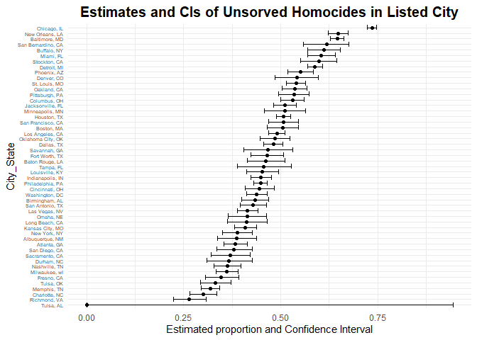

p8105_hw5_yl5508
================
Yifei LIU
2023/11/05

It’s a proj for HW5 about ITERATION.  

``` r
library(tidyverse)
options(digits = 2)
```

## Problem 1

``` r
vic_clean =
  read_csv("./data/homicide-data.csv") |>
  janitor::clean_names() |>
  mutate(city_state = str_c(city, ", ", state))
```

``` r
tot_hom =
  vic_clean |>
  group_by(city_state) |>
  summarise(
    total_homocide = n(),
    unsolved_homocide = sum(disposition  %in% c("Closed without arrest
", "Open/No arrest")))
```

``` r
Bal_hom =
  vic_clean |>
  filter(city_state == "Baltimore, MD") |>
  group_by(city_state) |>
  summarise(
    total_homocide = n(),
    unsolved_homocide = sum(disposition  %in% c("Closed without arrest
", "Open/No arrest")))

Bal_propt = prop.test(Bal_hom |> pull(unsolved_homocide), Bal_hom |> pull(total_homocide), alternative = c("two.sided"), conf.level = 0.95)

Bal_propt_tidy = broom::tidy(Bal_propt)

save(Bal_propt_tidy, file = "./results/Bal_propt_tidy.RData")

Bal_propt_est = Bal_propt_tidy |> pull(estimate)

Bal_proptest_int = str_c(Bal_propt_tidy |> pull(conf.low), ",", Bal_propt_tidy |> pull(conf.high))
```

0.59 (0.57,0.61)

``` r
output = purrr::map2(tot_hom$unsolved_homocide, tot_hom$total_homocide, ~ prop.test(x = .x, n = .y, alternative = c("two.sided"), conf.level = 0.95))

tot_propt_tidy =
  map_dfr(output, broom::tidy)|>
  select(estimate, conf.low, conf.high) |>
  mutate(city_state = tot_hom$city_state) |>
  mutate(CI = str_c("(", conf.low, ", ", conf.high, ")")) |>
  select(city_state, everything())

head(tot_propt_tidy, 5)
```

    ## # A tibble: 5 × 5
    ##   city_state      estimate conf.low conf.high CI                                
    ##   <chr>              <dbl>    <dbl>     <dbl> <chr>                             
    ## 1 Albuquerque, NM    0.249    0.207     0.296 (0.206544173424625, 0.29601958549…
    ## 2 Atlanta, GA        0.324    0.295     0.354 (0.294584103381076, 0.35430837487…
    ## 3 Baltimore, MD      0.592    0.573     0.610 (0.573384885712592, 0.60995039741…
    ## 4 Baton Rouge, LA    0.425    0.377     0.473 (0.377214266895452, 0.47323142604…
    ## 5 Birmingham, AL     0.354    0.321     0.388 (0.32077965059004, 0.388144469939…

``` r
#or use code below
output = vector("list", length = nrow(tot_hom))

for (i in 1:nrow(tot_hom)) {
  output[[i]] = broom::tidy(prop.test(tot_hom$unsolved_homocide[[i]], tot_hom$total_homocide[[i]], alternative = c("two.sided"), conf.level = 0.95)) |>
    unnest(cols = everything())
}

tot_propt_tidy =
  bind_rows(output) |>
  select(estimate, conf.low, conf.high) |>
  mutate(city_state = tot_hom$city_state) |>
  mutate(CI = str_c("(", conf.low, ", ", conf.high, ")")) |>
  select(city_state, everything())
```

``` r
tot_propt_tidy |>
  ggplot(aes(y = reorder(city_state, estimate))) + 
  geom_point(aes(x = estimate)) +
  geom_errorbar(aes(xmin = conf.low, xmax = conf.high)) +
  labs(
    x = "Estimated proportion and 95% Confidence Interval",
    y = "City_State",
    title = "Estimates and CIs of Unsorved Homocides in Listed City") +
  theme_minimal() +
  theme(plot.title = element_text(size = 15, face = "bold", hjust = 0.5), axis.text.y = element_text(size = 5))
```

<!-- -->

## Problem 2

``` r
lon_con = list()
for (i in 1:10) {
  path = str_c("./data/", "con_", if_else(i<10, str_c("0", as.character(i)), as.character(i)), ".csv")
  res = read_csv(path)
  res = res |> mutate(id = as.character(i))
  lon_con[[i]] = res
}
lon_con_data =
  bind_rows(lon_con) |>
  pivot_longer(week_1:week_8, names_to = "week", values_to = "observation") |>
  mutate(week = str_extract(week, "(?<=^.{5}).")) |>
  mutate(arm = "con")

lon_exp = list()
for (i in 1:10) {
  path = str_c("./data/", "exp_", if_else(i<10, str_c("0", as.character(i)), as.character(i)), ".csv")
  res = read_csv(path)
  res = res |> mutate(id = as.character(i))
  lon_exp[[i]] = res
}
lon_exp_data = bind_rows(lon_exp) |>
  pivot_longer(week_1:week_8, names_to = "week", values_to = "observation") |>
  mutate(week = str_extract(week, "(?<=^.{5}).")) |>
  mutate(arm = "exp")

lon_data =
  bind_rows(lon_con_data, lon_exp_data) |>
  arrange(id) |>
  janitor::clean_names()

head(lon_data, 5)
```

    ## # A tibble: 5 × 4
    ##   id    week  observation arm  
    ##   <chr> <chr>       <dbl> <chr>
    ## 1 1     1            0.2  con  
    ## 2 1     2           -1.31 con  
    ## 3 1     3            0.66 con  
    ## 4 1     4            1.96 con  
    ## 5 1     5            0.23 con

``` r
res =
  tibble(
    file = list.files("./data/"),
    path = str_c("./data/", file)
  )
data = bind_rows(purrr::map(res$path, read_csv))
data
```
